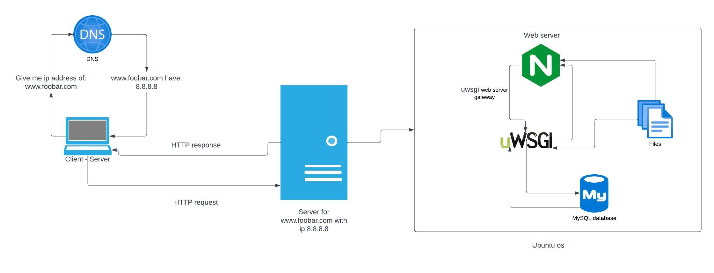

# Simple Web Stack

## Description

This web infrastructure is basic and hosts a website that can be accessed at www.foobar.com. The server's network is not protected by firewalls or SSL certificates. All components (database, application server) share the server's resources (CPU, RAM, and SSD).

## About this infrastructure

### A server is

A server is a computer program or system that provides functionality for other programs or devices, called "clients". This architecture is called the client–server model.

Servers can be either physical machines or virtual machines. Physical servers are dedicated computers that are used to run server software. Virtual servers are software programs that can run on top of a physical server

Servers can be used for a variety of purposes, including:

- Host websites and web applications
- Storage and share files
- Send and receiving emails
- Run software applications
- Manage databases etc.

### The role of the domain name is

A unique identifier for a website on the internet. It is the address that people type into their web browser to visit a website. For example, the domain name for this project is www.foobar.com.

### Type DNS record www in www.foobar.com is

A record you can check by using this command `dig A www.foobar.com`

### The role of web server

The web server is the software that powers the internet. It is responsible for receiving and responding to requests from web browsers. When you visit a website like `www.foobar.com`, your web browser sends a request to the web server for the website's HTML files. The web server then retrieves the HTML files from its storage and sends them back to your web browser. Your web browser then displays the HTML files to you.

Most popular web servers:
- Apache
- Nginx
- Microsoft IIS
- Google Cloud Endpoints
- AWS Elastic Beanstalk

### The role of the database is

Store access maintain and manage data or informations with originized method.

### Server using to communicate with the client and requesting the website is

When a user requests a website, the server uses the HTTP (Hypertext Transfer Protocol) protocol of TCP/IP to communicate with the client or user. HTTP is a text-based protocol that is used to transfer web pages and other resources over the internet.