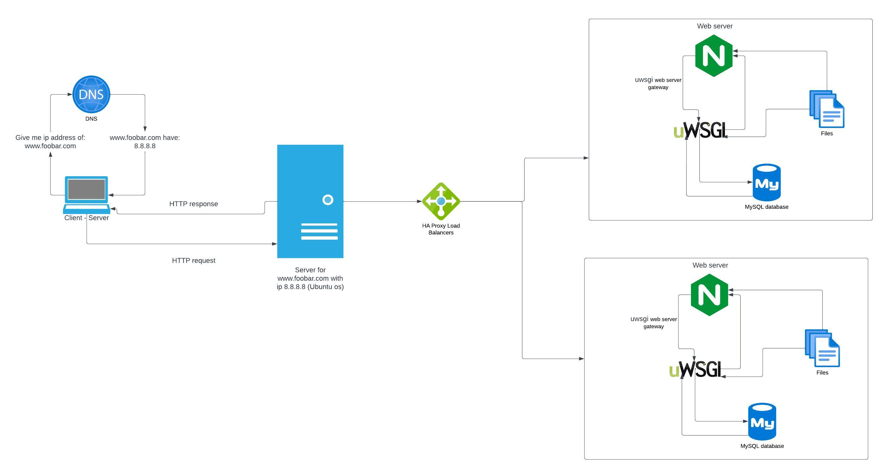

# Simple Web Stack

## Description

this web infrastructure is spread across two servers to reduce traffic to the main server. A load balancer distributes some of the traffic to the replica server, which is a copy of the main server.

## About this infrastructure

* The load balancer uses a distribution algorithm to decide which server to send requests to. This algorithm is called Round Robin, and it works by sending requests to each server in turn, based on their weights. Round Robin is a smooth and fair algorithm, and it allows server weights to be adjusted on the fly.

* The load balancer is configured in an Active-Passive setup instead of an Active-Active setup. In an Active-Active setup, the load balancer distributes traffic across all servers. This prevents any one server from becoming overloaded and improves throughput and response times. In an Active-Passive setup, only one server is active at a time. The other server is passive, or on standby. If the active server fails, the passive server becomes active.

* A Primary-Replica (or Master-Slave) cluster is a type of database cluster where one server is the primary server and the other server is a replica of the primary server. The primary server can perform both read and write operations, while the replica server can only perform read operations. When the primary server performs a write operation, the data is synchronized to the replica server.

* The difference between the primary node and the replica node in regard to the application is that the primary node is responsible for all write operations, while the replica node is only responsible for read operations. This means that the replica node can help to reduce the load on the primary node and improve performance for read operations.